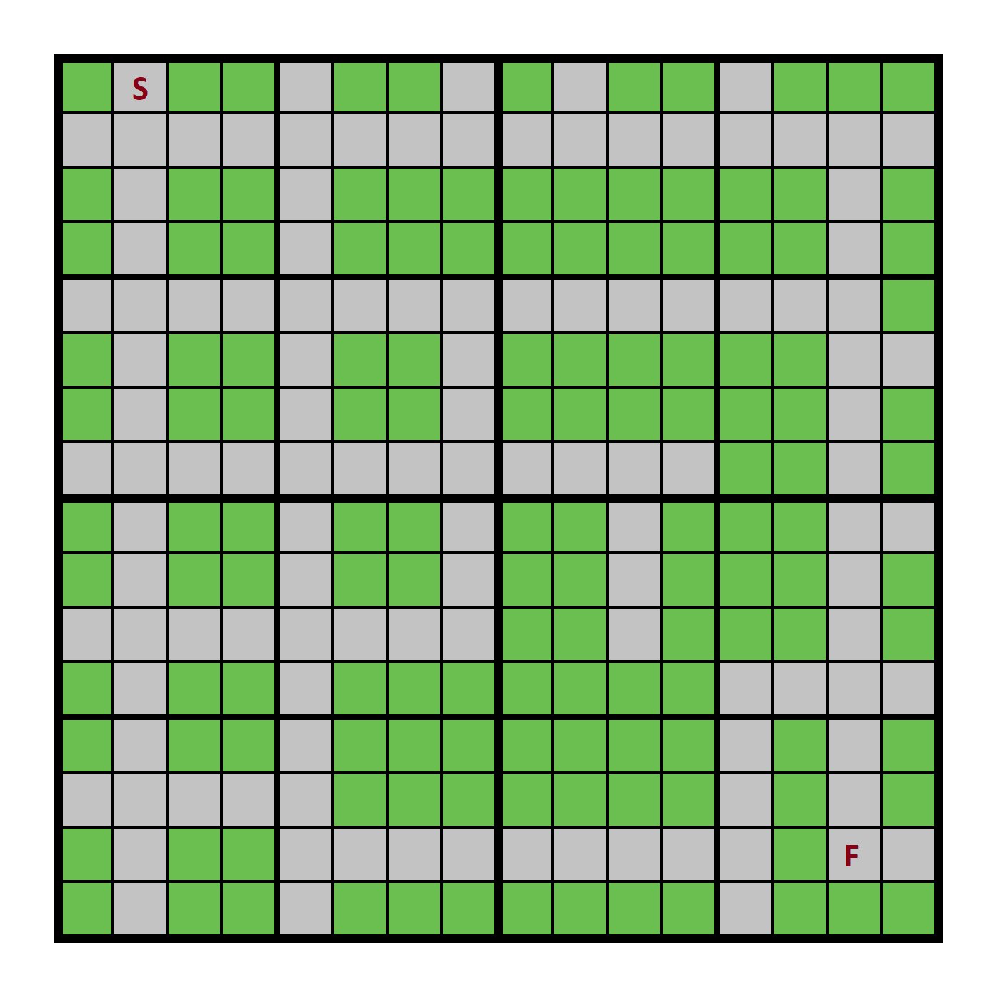

# delivery-route-rl
Reinforcement learning for optimizing transit to a delivery destination

## Summary

The purpose of this project is to create a reinforcement learning model capable
of solving a simulated environment where an agent needs to traverse a delivery
route.

_Diagram of the environment -- where S represents the starting point of the
delivery route and F respresents the destination_

## Setup

~~~
conda env install -f environment.yml
~~~